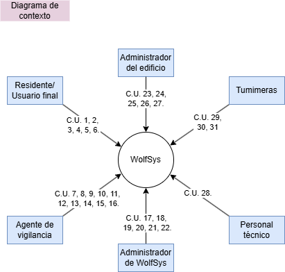
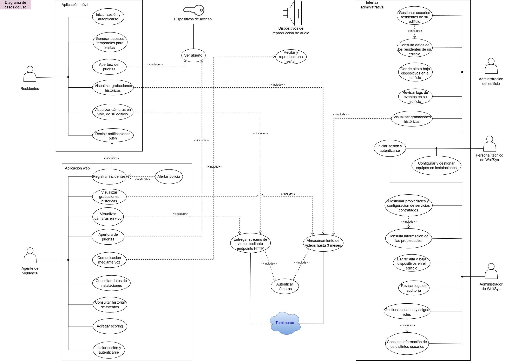

### Actores Principales y sus Casos de Uso
- **Residente / Usuario Final**  
  - **C.U. 1:** Iniciar sesión en la aplicación móvil.
  - **C.U. 2:** Visualiza cámaras en vivo de su edificio desde la aplicación móvil.  
  - **C.U. 3:** :Recibe notificaciones push ante intentos de ingreso o llamadas desde el portero virtual.  
  - **C.U. 4:** Genera accesos temporales (PIN o enlace) para visitas.  
  - **C.U. 5:** Ejecuta apertura remota o en sitio de puerta o barrera.
  - **C.U. 6:** Visualizar grabaciones históricas de su edificio desde la aplicación móvil.

- **Agente de Vigilancia**  
  - **C.U. 7:** Inicia sesión en la aplicación web.
  - **C.U. 8:** Asigna un cierto valor o criterio de prioridad a cada una de sus cámaras (scoring manual inicial). Los criterios pueden ser estáticos (ubicación, tipo de acceso) o dinámicos (detección de movimiento, reconocimiento facial). Debe permitir la integración futura de módulos de scoring automáticos (módulos de IA o criterios adaptativos).
  - **C.U. 9:** Visualiza feeds de cámaras priorizados según sus criterios.  
  - **C.U. 10:** Interviene mediante comunicación de voz.
  - **C.U. 11:** Interviene mediante apertura de puerta.  
  - **C.U. 12:** Registra incidentes.
  - **C.U. 13:** Escalar alertas a móvil o policía.  
  - **C.U. 14:** Consulta el historial de eventos de un determinado feed o ubicación.
  - **C.U. 15:** Visualiza grabaciones históricas.
  - **C.U. 16:** Consulta información de las instalaciones que vigila.

- **Administrador de WolfSys**  
  - **C.U. 17:** Gestiona propiedades y configuraciones de servicios contratados, permitiendo configuraciones predefinidas (torre, complejo, torre ejecutiva).
  - **C.U. 18:** Consulta información de las propiedades.
  - **C.U. 19:** Gestiona usuarios, y asigna roles de residentes, personal de servicio o agentes.
  - **C.U. 20:** Consulta información de los distintos usuarios.
  - **C.U. 21:** Da de alta o baja dispositivos (cámaras, lectores, tótems).  
  - **C.U. 22:** Revisa logs de auditoría.
  - **C.U. 23:** Iniciar sesión en la interfaz administrativa.

- **Administrador del Edificio**  
  - **C.U. 23:** Iniciar sesión en la interfaz administrativa.
  - **C.U. 24:** Gestiona los usuarios residentes de su edificio.
  - **C.U. 25:** Consulta información de los residentes de su edificio.
  - **C.U. 26:** Da de alta o baja dispositivos (cámaras, lectores, tótems) en su edificio.  
  - **C.U. 27:** Revisa logs de eventos en su edificio.
  - **C.U. 28:** Visualizar grabaciones históricas de su edificio desde la interfaz administrativa.

- **Personal Técnico de WolfSys**
  - **C.U. 23:** Iniciar sesión en la interfaz administrativa.
  - **C.U. 29:** Configura y gestiona equipos en instalaciones.  

- **Sistema “Tumimeras” (Proveedor de Videostreaming)**  
  - **C.U. 30:** Autentica cámaras.
  - **C.U. 31:** Expone endpoints HTTP para listar y consumir streams disponibles.  
  - **C.U. 32:** Almacena las grabaciones, hasta 3 meses en caliente y luego en frío.

- **Dispositivos de acceso (puertas automáticas, porteros, barreras, etc)**
  - **C.U. 33:** Abrirse

- **Dispositivos de reproducción de audio (porteros con parlante)**
  - **C.U. 34:** Recibir y reproducir una transmisión en tiempo real.

---
## Diagrama de contexto:

---

## Diagrama de casos de uso:

