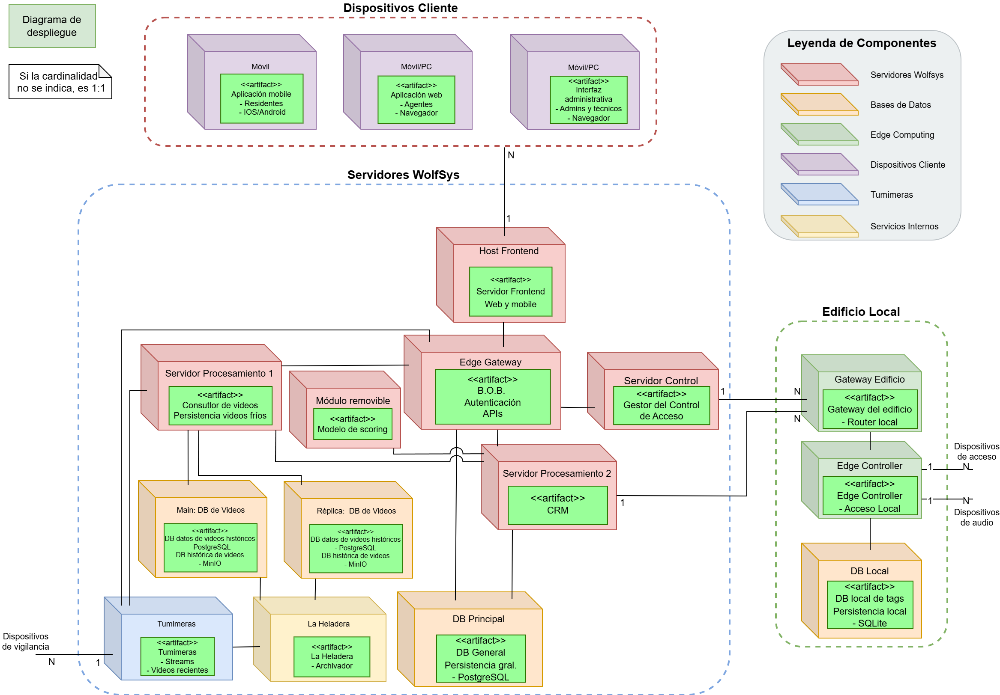

# Modelo de Despliegue

Este documento describe el modelo de despliegue para el sistema **WolfSys**, explicando el propósito y funcionamiento de cada componente, así como sus interfaces y relaciones. El sistema sigue una arquitectura distribuida en **6 capas principales**: presentación, borde, servicios de aplicación, servicios de negocio, persistencia de datos e infraestructura local.

---

## Capa de Presentación

### App Móvil
- Aplicación para residentes (iOS/Android).
- Permite visualizar cámaras, acceder a grabaciones, gestionar accesos y recibir notificaciones.

### App Web
- Aplicación web para agentes.
- Accesible desde navegador.
- Permite consultar transmisiones, eventos y administrar interacciones.

### Panel Administrativo
- Interfaz web para administradores del sistema, técnicos y operadores.
- Permite gestión de usuarios, edificios, accesos, dispositivos y logs del sistema.

---

## Capa de Servicios de Aplicación

### Frontend
- Aplicación web y móvil hosteada en un servidor.
- Es el intermediario entre los dispositivos cliente (web o móvil) y el gateway B.O.B.
- Expone la interfaz de usuario y realiza las llamadas necesarias hacia las APIs del sistema.

### Edge Gateway (B.O.B.)
- Componente central del sistema.
- Encargado de la autenticación, autorización y enrutamiento de peticiones.
- Punto de entrada principal a la lógica del sistema y conexión con servicios backend.

---

## Capa de Servicios de Negocio

### Servidor de Procesamiento 1
- Responsable de la consulta y procesamiento de videos fríos.
- Se conecta a las bases de datos históricas y al módulo de scoring.
- Realiza persistencia de videos procesados.

### Servidor de Procesamiento 2
- Componente de CRM.
- Administra interacciones y datos relacionados con usuarios, eventos y contactos.

### Módulo Removible (Scoring)
- Contiene el modelo de scoring.
- Prioriza transmisiones de video según contexto e historial.
- Integrado al sistema de procesamiento para mejorar la eficiencia del monitoreo.

### Servidor de Control
- Gestor central de control de acceso.
- Recibe peticiones desde las APIs y coordina la comunicación con los gateways y controladores del edificio.

---

## Capa de Persistencia y Almacenamiento

### Main: Base de Datos de Videos
- Base de datos tipo objeto (MinIO).
- Almacena videos históricos y metadata asociada.

### Réplica: Base de Datos de Videos
- Copia redundante para resiliencia ante fallos.

### Base de Datos Principal
- Base de datos general del sistema (PostgreSQL).
- Contiene usuarios, roles, accesos, logs, configuraciones, edificios, etc.

### La Heladera
- Sistema de archivado de largo plazo.
- Transfiere automáticamente videos fríos (mayores a 3 meses) desde el almacenamiento activo.

---

## Capa de Edge Computing

### Gateway del Edificio
- Router local del edificio.
- Sincroniza credenciales y configuraciones de acceso con los Edge Controllers.
- Enruta tráfico hacia dispositivos y controladores físicos.

### Edge Controller
- Controlador local de accesos.
- Verifica autenticación offline mediante una base de datos embebida.
- Coordina apertura de puertas, emisión de audio y lectura de tags RFID.

### DB Local (Tags)
- Base de datos SQLite embebida en cada controlador.
- Contiene los tags RFID válidos para operar offline.
- Permite funcionamiento en modo degradado si se pierde conexión con el servidor central.

---

## Capa de Infraestructura de Vigilancia

### Tumimeras
- Dispositivos de vigilancia (cámaras inteligentes).
- Emiten streams de video en tiempo real hacia los servidores de procesamiento.
- Integradas directamente con el sistema.

---

## Interacciones entre Capas

- Las apps cliente (móvil/web/admin) se comunican con el **Edge Gateway (B.O.B.)**, que autentica y enruta las peticiones a los servicios internos.
- El **Frontend**, aunque ubicado del lado del servidor, sirve como interfaz web/mobile que se consume desde los dispositivos cliente.
- El **Servidor de Control** gestiona los accesos físicos mediante comunicación con los **Gateways de edificio** y **Edge Controllers**.
- El **Modelo de scoring** se comunica con los servidores de procesamiento para priorizar transmisiones según el historial.
- Las **Tumimeras** envían video en tiempo real a los servidores.
- Las bases de datos de video permiten consultas eficientes y redundancia mediante réplicas.
- **La Heladera** gestiona el archivado de largo plazo.
- Los **Edge Controllers** pueden operar autónomamente en caso de pérdida de conectividad, gracias a la **DB local** embebida.

---

## Diagrama de Despliegue

