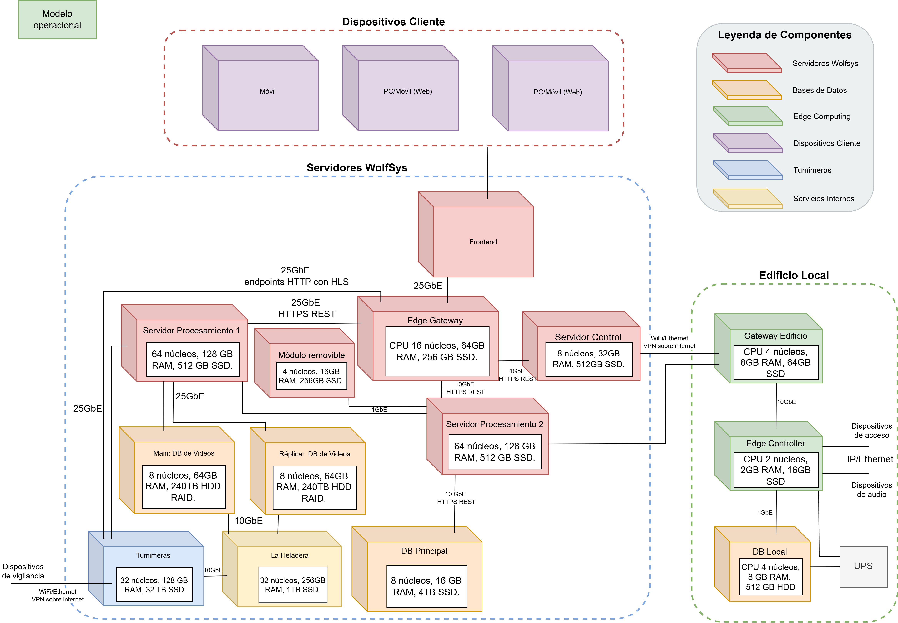

# Modelo Operacional

Este documento describe la arquitectura del sistema WolfSys, orientada a la gestión, procesamiento y almacenamiento eficiente de videos provenientes de dispositivos de vigilancia, con integración de acceso y servicios internos.

---

## Componentes Principales

### 1. Dispositivos Cliente
- **Móvil, PC**  
  Interactúan con el sistema mediante el frontend. Acceden a las aplicaciones web/mobile.

---

### 2. Servidores WolfSys

#### Frontend
- Aplicación web/mobile de acceso para usuarios, administrativos y agentes de vigilancia.
- Hosteado en un servidor.

#### Servidores de Procesamiento
- **Procesamiento 1 y 2**: 
  - 16 núcleos, 64GB RAM, 2TB SSD.

- **Módulo Removible**:
  - 4 núcleos, 16GB RAM, 512GB SSD.

#### Edge Gateway
- Servidor físico Linux, 8 núcleos, 32GB RAM, 1TB SSD.
- Administra flujos entrantes de datos en tiempo real.

#### Servidor de Control
- 8 núcleos, 32GB RAM, 512GB SSD.
- Coordina tareas de monitoreo, alertas y balanceo de carga.

---

### 3. Bases de Datos

#### Main: DB de Videos
- 8 núcleos, 64GB RAM, 8x30TB HDD con RAID 6.
- 180TB de almacenamiento efectivo.
- Almacenamiento en frío primario de videos provenientes de tumimeras.
- Capacidad diseñada para grandes volúmenes de datos.

#### Réplica: DB de Videos
- Espejo de la anterior para asegurar disponibilidad durante las transferencias, y para mayor tolerancia a fallos.

#### DB Principal
- 8 núcleos, 2GB RAM, 1TB SSD.
- Manejo de datos de configuración, usuarios, logs, accesos.

---

### 4. Tumimeras
- 4 núcleos, 8GB RAM, 2TB SSD.
- Almacenamiento de hasta 3 meses de videos en caliente.
- Conectado directamente a el Edge Gateway para transmisión de videos almacenados en caliente.
- Conectado directamente a la DB de Videos para descarga de datos a frío.

---

### 5. "La Heladera" (Módulo de Enfriamiento de Video)
- 8 núcleos, 16GB RAM, 1TB SSD.
-  **Almacena:**
   - El `.mp4.zst` en una de las **DB Históricas de Video (MinIO)**.
   - Los metadatos en una **DB de Datos Históricos (PostgreSQL)**, referenciados por la misma ID.

---

## Edificio Local

### Gateway Edificio
- CPU 4 núcleos, 8GB RAM, 64GB SSD.
- Puente entre dispositivos físicos (acceso, audio) y el Edge Gateway.

---

### Edge Controller
- CPU 2 núcleos, 2GB RAM, 16GB SSD.
- Controla dispositivos de audio, porteros automáticos, alertas.

---

### DB Local
- Almacenamiento mínimo para logs locales o eventos temporales.
- Se basa en SQLite, el hardware específico dependerá del edificio y sus necesidades.

---

## Justificación Técnica

### Almacenamiento
- Las bases de datos RAID para 180TB fueron dimensionadas considerando cargas de video provenientes de cientos de edificios, cada uno con varias cámaras.
- Se estima un consumo de hasta 100MB diarios por cámara, lo que equivale a 91TB anuales para 2500 cámaras (estimado de 500 edificios con un promedio de 5 cámaras por edificio).

### Procesamiento Distribuido
- Dos servidores de procesamiento trabajan en paralelo, cada una con sus tareas intensivas designadas.
- El módulo removible permite la fácil modificación o intercambio del mismo a un futuro. Pensado para los módulos de scoring con IA o criterios dinámicos que se plantean implementar.

### Redundancia y Alta Disponibilidad
- Replicación de la base de datos de videos.

--

## Modelo operacional

